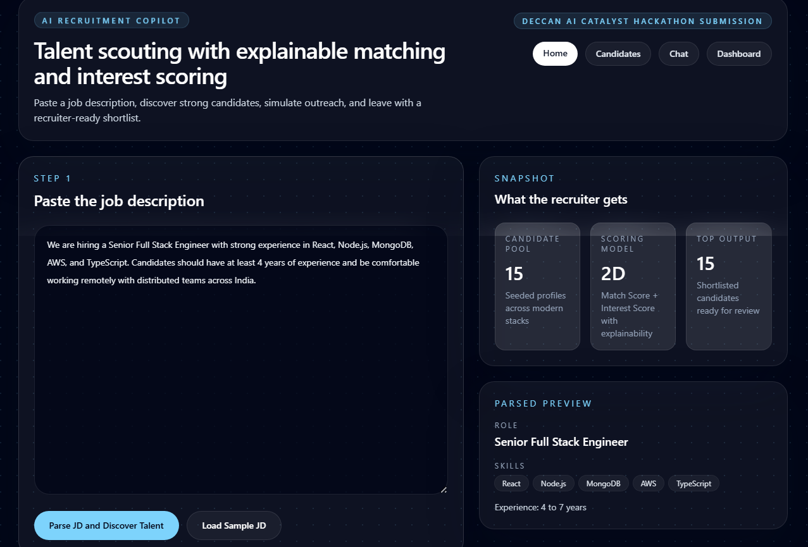
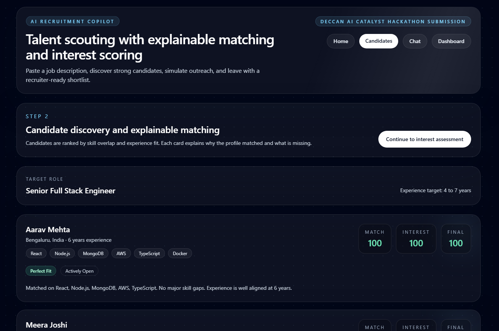
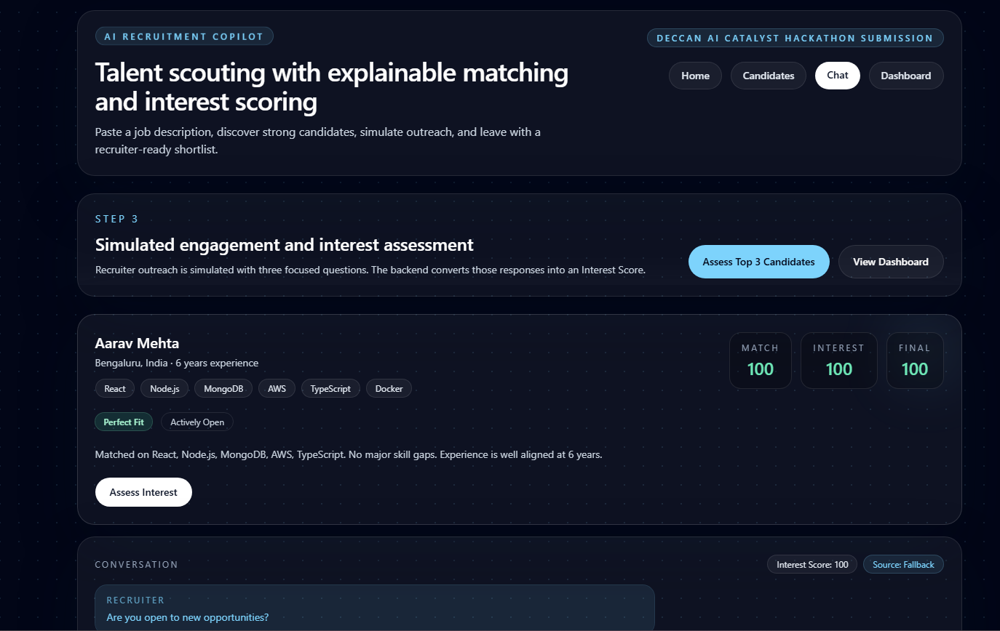
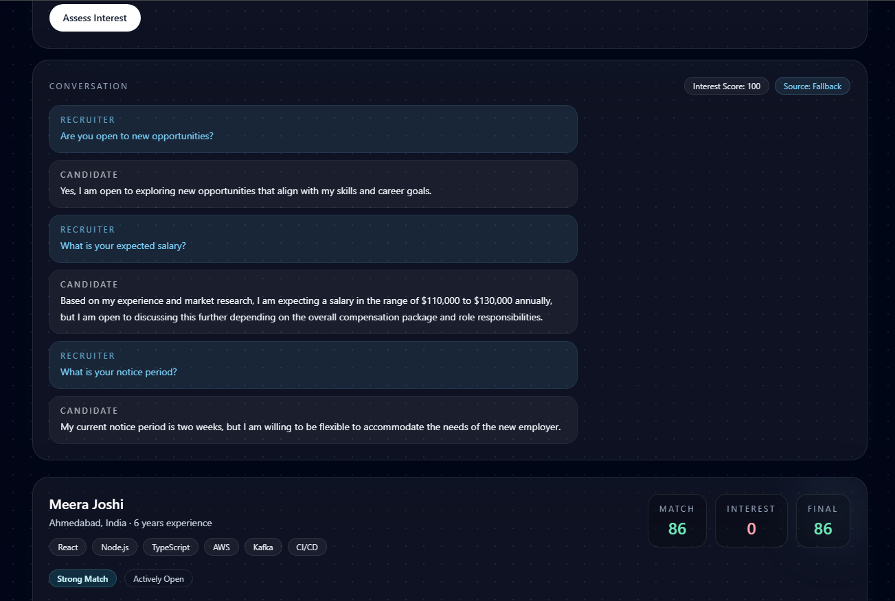
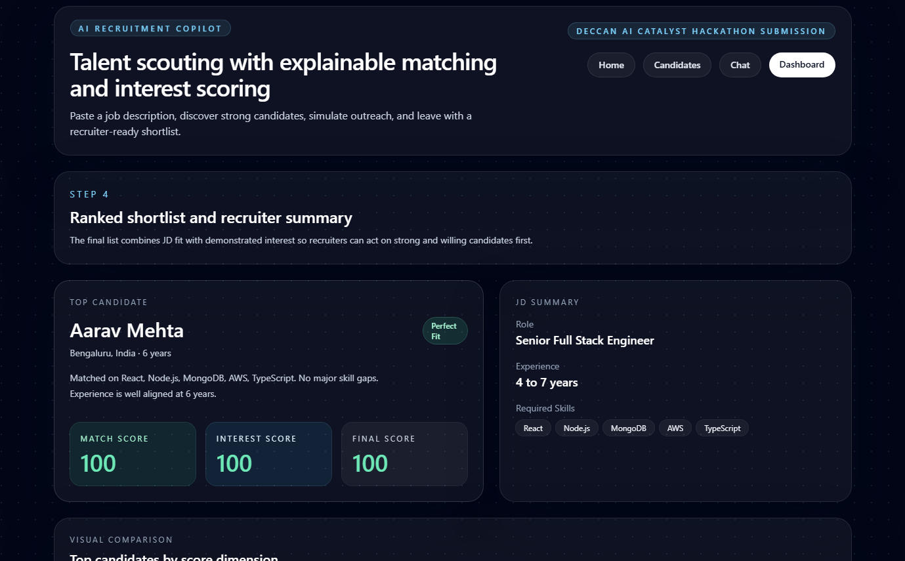
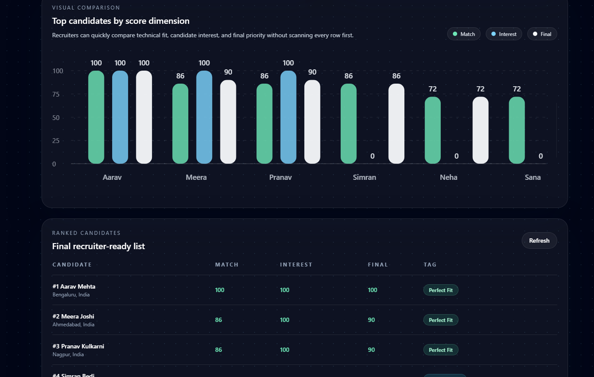

# AI-Powered Talent Scouting & Engagement Agent

An AI-assisted recruiter copilot built for the **Deccan AI Catalyst Hackathon**. The application accepts a job description, extracts hiring requirements, finds the best-fit candidates from a seeded talent pool, simulates recruiter outreach to assess candidate interest, and returns a ranked shortlist with explainable scoring.

The goal is to help recruiters move from a raw JD to an actionable shortlist in minutes instead of spending hours manually screening profiles and chasing candidate intent.

## Why This Project

Recruiters usually lose time in three places:

- understanding an unstructured job description
- comparing many profiles against the same role
- checking whether strong candidates are actually interested and available

This project turns that workflow into a single end-to-end experience:

1. Paste a JD
2. Parse the role, skills, and experience requirements
3. Match the JD against a candidate database
4. Simulate recruiter-to-candidate outreach using AI
5. Produce a final recruiter-ready shortlist ranked by both fit and intent

## Core Capabilities

- **JD Parsing**
  Converts raw job descriptions into structured hiring requirements including role, skills, experience range, and location hints.

- **Candidate Discovery**
  Matches the parsed JD against a seeded database of diverse candidate profiles.

- **Explainable Matching**
  Every candidate includes a `Match Score` plus a human-readable explanation of matched skills, missing skills, and experience alignment.

- **AI-Simulated Outreach**
  The system asks recruiter-style questions and generates realistic candidate responses using OpenAI.

- **Interest Assessment**
  Candidate replies are converted into an `Interest Score` using rule-based scoring around openness, salary expectations, and notice period.

- **Ranked Shortlist**
  Candidates are prioritized using a combined `Final Score` so recruiters can act on the strongest and most interested prospects first.

- **Recruiter-Friendly Dashboard**
  Includes score cards, visual comparison charts, candidate tags, and a final ranked table.

## Product Workflow

```text
Job Description
   ↓
AI Parsing
   ↓
Candidate Matching + Explainability
   ↓
Simulated Candidate Outreach
   ↓
Interest Scoring
   ↓
Final Ranked Shortlist
```

## Tech Stack

### Frontend

- React
- Vite
- React Router
- Tailwind CSS

### Backend

- Node.js
- Express

### AI

- OpenAI API
- Deterministic fallback logic for reliability when API access is unavailable

### Data Layer

- JSON-backed seeded candidate dataset

## Key Features in Detail

### 1. Job Description Parsing

The recruiter pastes a JD into the home page. The backend extracts:

- target role
- required skills
- experience range
- location hint

If OpenAI is configured, parsing is AI-driven. If not, the system falls back to a deterministic parser so the prototype remains demo-safe.

### 2. Candidate Matching

The app compares the parsed JD against a seeded candidate pool and computes:

- skill overlap
- experience alignment
- overall match score

Each candidate also receives an explanation such as:

> Matched on React, Node.js, AWS, TypeScript. Missing MongoDB. Experience is well aligned at 6 years.

### 3. Simulated Conversational Engagement

The chat page simulates recruiter outreach using three structured questions:

1. Are you open to new opportunities?
2. What is your expected salary?
3. What is your notice period?

The candidate-side answers are AI-generated from profile context. The UI reveals messages progressively so evaluators can see the simulation happen instead of only seeing a static transcript.

### 4. Interest Scoring

Candidate responses are converted into an `Interest Score` based on:

- openness to opportunities
- salary alignment
- notice period

### 5. Final Ranking

The application computes:

```text
finalScore = 0.7 * matchScore + 0.3 * interestScore
```

This helps recruiters prioritize both technical fit and conversion likelihood.

## Scoring Logic

### Match Score

The current implementation gives weight to:

- **70%** skill overlap
- **30%** experience fit

### Interest Score

The current implementation derives score from candidate responses:

- open to switch: up to `+40`
- reasonable salary expectation: up to `+30`
- short notice period: up to `+30`

### Final Score

```text
finalScore = 0.7 * matchScore + 0.3 * interestScore
```

## Architecture

Detailed architecture notes are available in [docs/architecture.md](docs/architecture.md).

High-level structure:

```text
.
|-- client/
|   |-- src/
|   |   |-- components/
|   |   |-- context/
|   |   |-- pages/
|   |   |-- services/
|   |   `-- utils/
|   |-- package.json
|   `-- vite.config.js
|-- server/
|   |-- config/
|   |-- controllers/
|   |-- data/
|   |-- routes/
|   |-- services/
|   |-- utils/
|   |-- index.js
|   `-- package.json
|-- docs/
|   |-- architecture.md
|   `-- sample-io.md
`-- README.md
```

## Project Pages

### Home Page

- paste job description
- parse role requirements
- begin candidate discovery

### Candidates Page

- review matched candidates
- compare match scores
- inspect explainability

### Chat Page

- simulate recruiter outreach
- watch AI-generated candidate replies
- assess candidate interest

### Dashboard Page

- see top candidate summary
- compare scores visually in chart form
- review final ranked shortlist

## API Reference

Base URL:

```text
http://localhost:5000/api
```

### `GET /health`

Health check endpoint.

Response:

```json
{
  "status": "ok"
}
```

### `POST /jd/parse`

Parses a raw job description into structured JSON.

Request:

```json
{
  "jobDescription": "We are hiring a Senior Full Stack Engineer with strong experience in React, Node.js, MongoDB, AWS, and TypeScript. Candidates should have at least 4 years of experience and be open to remote work."
}
```

Sample response:

```json
{
  "role": "Senior Full Stack Engineer",
  "skills": ["React", "Node.js", "MongoDB", "AWS", "TypeScript"],
  "experience": {
    "min": 4,
    "max": 7
  },
  "location": "Remote",
  "source": "openai"
}
```

### `POST /match`

Finds matching candidates for the supplied JD.

Request:

```json
{
  "jobDescription": "We are hiring a Senior Full Stack Engineer with strong experience in React, Node.js, MongoDB, AWS, and TypeScript. Candidates should have at least 4 years of experience and be open to remote work."
}
```

Response includes:

- `parsedJd`
- `rankedCandidates`
- match scores
- explanations
- ranking tags

### `POST /chat`

Generates AI-driven candidate answers and interest scoring.

Request:

```json
{
  "candidateId": "cand-001",
  "candidate": {
    "id": "cand-001",
    "name": "Aarav Mehta",
    "skills": ["React", "Node.js", "MongoDB", "AWS", "TypeScript"],
    "experience": 6,
    "matchScore": 92
  },
  "questions": [
    "Are you open to new opportunities?",
    "What is your expected salary?",
    "What is your notice period?"
  ]
}
```

Sample response:

```json
{
  "candidateId": "cand-001",
  "answers": [
    "Yes, I am open to exploring new opportunities that align with my skills and career goals.",
    "I am expecting around 24 to 28 LPA depending on role scope and growth opportunities.",
    "My notice period is 30 days, and I can support a smooth transition."
  ],
  "interestScore": 100,
  "finalScore": 94,
  "source": "openai"
}
```

### `GET /results`

Returns the latest ranked shortlist generated in the current app session.

## Local Setup

### 1. Clone the repository

```bash
git clone https://github.com/Nishu-06/ai-talent-scouting-agent.git
cd ai-talent-scouting-agent
```

### 2. Install dependencies

```bash
npm install
```

### 3. Configure environment

Create `server/.env` using `server/.env.example`.

```env
PORT=5000
CLIENT_URL=http://localhost:5173
OPENAI_API_KEY=your_openai_api_key
OPENAI_MODEL=gpt-4.1-mini
```

### 4. Start the app

```bash
npm run dev
```

Frontend:

```text
http://localhost:5173
```

Backend:

```text
http://localhost:5000
```

### 5. Production build

```bash
npm run build
npm run start
```

## Demo Flow

Recommended demo sequence:

1. Open the home page and paste a JD
2. Show parsed role, skills, and experience
3. Move to candidate matches and explain scoring
4. Open the chat page and run `Assess Interest`
5. Let the simulated conversation reveal step-by-step
6. Show the dashboard chart and final shortlist

## Sample Inputs and Outputs

See [docs/sample-io.md](docs/sample-io.md) for sample job descriptions and ranked output examples.

## Screenshots

<table>
  <tr>
    <td align="center"><strong>Home Page</strong></td>
    <td align="center"><strong>Candidate Matching</strong></td>
  </tr>
  <tr>
    <td></td>
    <td></td>
  </tr>
  <tr>
    <td align="center"><strong>Chat Simulation 1</strong></td>
    <td align="center"><strong>Chat Simulation 2</strong></td>
  </tr>
  <tr>
    <td></td>
    <td></td>
  </tr>
  <tr>
    <td align="center"><strong>Dashboard Overview</strong></td>
    <td align="center"><strong>Dashboard Details</strong></td>
  </tr>
  <tr>
    <td></td>
    <td></td>
  </tr>
</table>

## Notes

- The candidate dataset is seeded and intentionally varied for demo purposes.
- Conversational engagement is simulated using AI-generated candidate responses.
- Fallback logic is included so the prototype remains functional even when OpenAI access is unavailable.

## License

This project is created for hackathon submission and demonstration purposes.
