# Architecture

```mermaid
flowchart LR
    A["Recruiter enters JD"] --> B["Frontend: Home Page"]
    B --> C["POST /api/jd/parse"]
    C --> D["OpenAI Service or Fallback Parser"]
    D --> E["Structured JD"]
    E --> F["POST /api/match"]
    F --> G["Matching Service"]
    G --> H["Scoring Service"]
    H --> I["Candidates Page"]
    I --> J["POST /api/chat"]
    J --> K["Chat Simulation Service"]
    K --> L["Interest Score"]
    L --> M["Final Ranking Engine"]
    M --> N["GET /api/results"]
    N --> O["Dashboard"]
```



## Backend Responsibilities

- `openaiService.js`
  Handles AI prompts for JD parsing and simulated candidate replies. If `OPENAI_API_KEY` is missing or a request fails, fallback logic ensures the app still works.

- `scoringService.js`
  Central place for skill, experience, interest, and final score calculations.

- `matchingService.js`
  Compares structured JD requirements against candidate data and generates recruiter-friendly explanations.

- `resultsStore.js`
  Keeps the latest recruiter session output so the dashboard can be loaded directly.

## Scoring Details

### Match Score

- Skill overlap contributes `70%`
- Experience fit contributes `30%`
- Final match score is capped to `0-100`

### Interest Score

- Openness to opportunities contributes `40%`
- Notice period contributes `25%`
- Salary expectation alignment contributes `20%`
- Tone and enthusiasm contributes `15%`

### Final Score

```text
finalScore = 0.7 * matchScore + 0.3 * interestScore
```

## Explainability

Each candidate includes:

- matched skills
- missing skills
- experience alignment summary
- availability context
- tag such as `Perfect Fit`, `High Match, Low Interest`, or `Warm Prospect`

